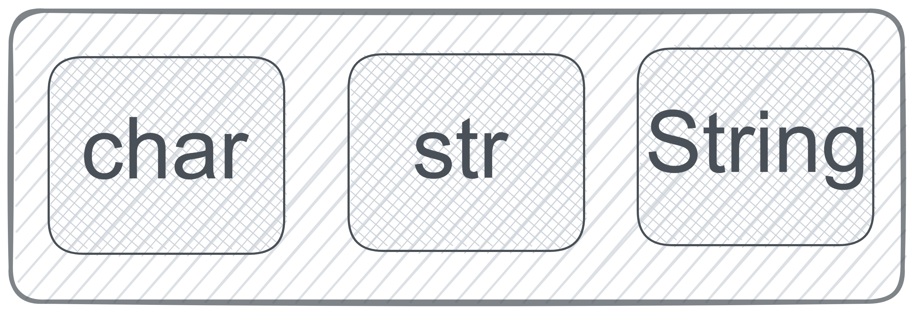
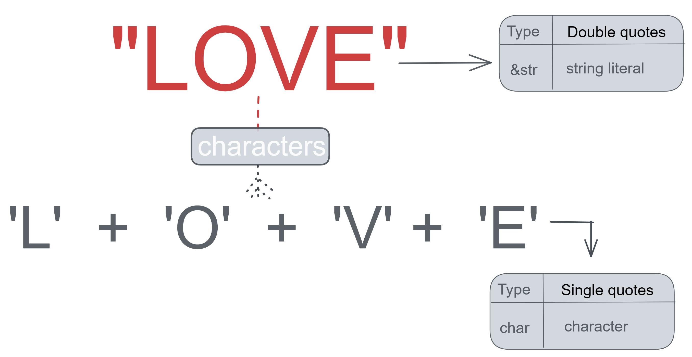
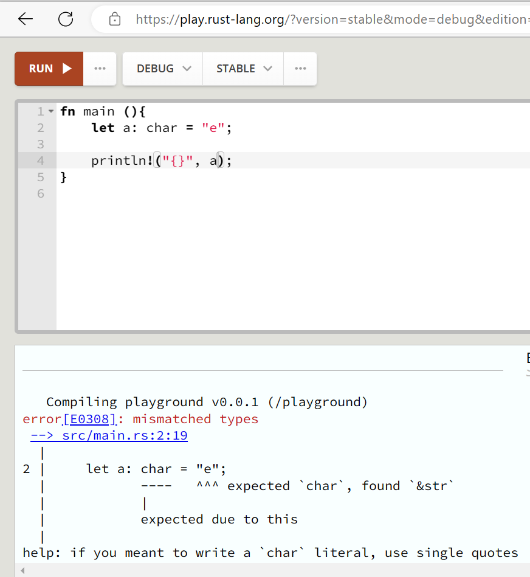

Everything in Rust can look like an overdo, or complex except they are only a myth about the language. In all sincerity, things are usually not black and white but gray. Strings aren't an exception in Rust. 

Strings are a sequence of characters - "H" "E" "L" "L" "O". All characters are strings but all strings aren't a character.

> Audiences: This writing is intended for devs of all levels. And complete beginners too who have some idea with [how to write a simple Rust program](https://kelvinsekx.hashnode.dev/hello-rust-for-first-timers).

This article is intentional about teaching from a super relatable and simple standpoint. Something I wished to have read in my early days into Rust. By the end of your reading, you would have gone through a very friendly overview of strings in Rust and its types.



Here are the forms of strings in Rust
- character - e.g 'a'
- string slice - e.g 'able'
- grow-able string - e.g 'able' + 'ness' = 'ableness'

## char Type
The [`char` type](https://doc.rust-lang.org/std/primitive.char.html) represent a single character of alphabet, number, punctuation or space. For example, 
- "God " is made up of 4 characters - 'G', 'o', 'd' and ' '. 
- "Hey" represent 3 characters of 'H','e' and 'y'.





Characters in Rust **must** be wrapped with single quote. Anything wrapped in double quotes are treated as a string literal even if it is a character.





## String Slice Type
This is the closest to typical string that comes to mind outside of Rust. One of the reason is because of the number of built-in methods it has at its disposal that allows inspecting itself eg `.contains()`, `.find()`, `.ends_with()` etc. 

String slice are read only. You can't mutate them.
It is denoted as `str`. Usually it is accompanied by a amper `&` sign like this `&str`.

```rust
let _string: &str;
```
A string slice would always point to a byte or something in memory. This means they are supposed to have a lifetime.

A string literal is an unconditional constant which is **directly entered into your source code**.
```rust
let _str: &'static str = "Hello World"
```

## Growable String
Growable strings are idnetified with the type keyword, `String`. This behaves like the constructor type for strings. Also this is the string type that is mutatable. 

Popular utility string mutation like Concatenation - merging two string literals to become one - can only be done with this type. 

```rust
// won't work, "Hello " is a literal and not growable string

let newString = "Hello " + "world" 
// literal + literal;

```

```rust
//🙌 works because the first argument is a Growable string + OTHERS

let newString = String::from("Hello ") + "world" 
// String + literal
let newString = "Hello ".toString() + "w" 
// String + character
```

Thank you again for reading thus far. You need to know how I am filled with joy when someone finds my writing useful. My goal is to keep sharing as I learn Rust in such a simple and friendly manner. 

**Drop a like if you find this writing useful**. It is the one of the ways to let me know how great I am doing.

Let's connect on Twitter at kelvinsekx.

************
## resources
[-] What's the difference between a string and a literal? https://stackoverflow.com/questions/7356135/whats-the-difference-between-a-string-and-a-literal

[-] A more indepth explore to Strings in Rust. https://betterprogramming.pub/strings-in-rust-28c08a2d3130
