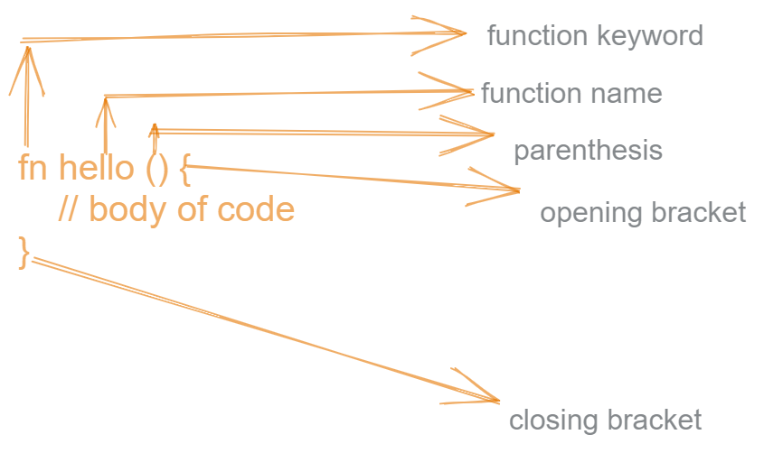

# Hello Rust
For the past 5 years on a row, [Rust has topped the Most Loved Programming (MLP) Languages](https://survey.stackoverflow.co/2022/#section-most-loved-dreaded-and-wanted-programming-scripting-and-markup-languages) according to StackOverflow Survey. Languages that fall under this category of MLP languages are usually robust, better intentional, and simple. They give developers who use them some special super powers that are more difficult to find in other Languages. 

[Survey has shown that Newbies and Junior devs are not very concerned with MLP languages](https://stackoverflow.blog/2023/01/26/comparing-tag-trends-with-our-most-loved-programming-languages/). They - the MLPs - are more harnessed by the seniors. While Newbies are known to favor Python and Javascript, they miss the sugar and goodness from the MLP languages usually with a wrong assumption that they are more difficult. I feel this could be faulted by the lack of many newbie targeted materials. So I hope this one fills some gap.

In this Hello Rust article, you will see for yourself how super simple and robust Rust is. I briefly discussed the problems I've seen Rust solve. After which you will build a simple calculator project with the language. Trust me the process will be slow, smooth and enjoyable.

> 💀 This writing is targeted at newbies to programming and first time Rust enthusiasts. I'll be assuming you do simple commands on the CLI, and you have hands on experience coding with something as rudimental as HTML and CSS.

## Hello Rust
We will start out with the ritual "Hello World" print. It's a nice way to get our feet wet. Before we jump straight to code, let's get set up 🔧🛠⚙.

### Set Up your Environment
> 💀 If you a set up Rust environment skip this section

The creator of Eslint, Nicholas C. Zakas, wrote [an excellent blog on setting up a Rust development environment with Visual Studio Code](https://humanwhocodes.com/blog/2022/12/rust-development-environment-visual-studio-code/). Whether or not you use Visual Studio Code, you will find it useful to setup. Kindly read the blog as a guide to set yourself up. I'll wait.

### Get Started
Now that you are all set up, do the following:
1. Create a folder. This folder is intended to be where our code resides. In our case, I'll name mine `Rust`.
2. Create an `hello.rs` file inside the newly created `Rust` folder,.
3. Compile the file by running `rustc hello.rs` in a terminal. Henceforth, when I mention compile I mean calling the `rutsc hello.rs` command.
4. You should see an error with `error[E0601]: 'main' function not found in crate 'hello...'`

OMG 😲 you just compiled and made a bold attempt to mastering Rust. Isn't that wonderful 🤩.
**********

Now that you have run your first Rust program, let's make the error in **4 above** disappear. But before we do that, let me tell you something ⚠.

Rust enforces only one entry point to your code (there is another way but that's beyond our scope now). If you are coming from a free-for-all language like JavaScript this might look a little strange. But with this little strictness comes what makes Rust easier to read.

The entry point is the `main` function 🎇. Rust will read your program only from this function. This may sound confusing so let's get down to some code already.

## Your First Rust Code
Inside your `hello.rs` file, copy and paste the code below.

```Rust
fn main (){
  println!("Hello World");
}
```

After successfully writing or pasting the code (whatever you choose to do), follow these instrcution:
1. Compile the code `rustc hello.rs` 
2. Run the compiled code:  If you use Linux or WSL enter `./hello` in the terminal and click enter, and for windows users use `.\hello.exe`.

You should see a shinny "Hello World" Program 🎉🙌.

> You should try to break the code to see if rust will compile outside a main file. Rename the `main` function to `mainr`, compile the code. You should see an error `warning: function mainr is never used`.

## Function in Rust
[A function](https://www.bbc.co.uk/bitesize/guides/zqh49j6/revision/5) encapculate blocks of code for reuse.



In best practices, a function is meant to return a value. There are two ways to return a value in Rust:
*  without a return keyword. In thiss case, the line **must not** end with a semi-colon `;`.
*  with a return keyword. You are at liberal to add a semi-color or not.

Choosing the type to use on a codebase depends on a lot of factors. For example: on a personal project those with a JavaScript background will prefer to use type 2 unlike someone who is from a Python background. On a team codebase, a consensus has to be reached on what way to ensure uniformity.

See the two ways to return a value in Rust.

```rust
// foo and foo2 won't work

// TYPE 1
fn foo (){
  4
}

// TYPE 2
fn foo2 (){
  return 4;
}
```

You can replace the body of your main function with one of this custom function of ours. Now compile and run the code.

```rust
fn foo () {
  4
}

fn main (){
  println!("{}", foo());
}
```

You will see an error `try adding a return type: '-> i32'`. Custom functions must have a return type and a parameter type.

```rust
fn foo ()->i32 {
  4
}

fn foo2 ()-> i32{
  return 4;
}

```

You can compare the example in this section with the first one. Tell me the changes you saw. Exactly, a return type `-> i32`. This leads us to the next to talk about.

## Strongly Typed
Rust is a strict typed language. The intention is to make our code easier to read and faster to know its intention. 

If you decide to stop reading this chapter out of fear with types, I can assure you it is only a misconception. Types are so so simple. They are an extra note used to restrict our values.

I really won't love to bore you with that for now but henceforth I will refer all number type as `i32`.

```rust
fn foo ()->i32 {
  4
}

fn main (){
  println!("{}", foo());
}
```

Compile your code and it works.

## Our calculator
Our calculator is meant to do only addition and subtraction. Hopely, I've made you realize how simple Rust can be. You can move on to add division, multiplication etc after this article. With no further ado, let's dive in.

We will start out by writing an `add` function 

```rust
fn add (a: i32, b: i32)-> i32{
  return a + b;
}
```

And then `substract`

```rust
fn subtract (a: i32, b: i32)->i32 {
  return a - b;
}
```

In our main function we have a little calculator 🎉.

```rust
...
fn main () {
  println!("{}", add(23, 45));
  println!("{}", subtract(23, 45))
}
```

## Limitation with our calculator.
When you try to run a decimal with our function, it won't work 😢.
I am sorry it is time to bore you with some popular number types and their meaning.

```rust
// floating/decimal number won't work
fn main () {
  println!("{}", add(23.4, 45));
  println!("{}", subtract(23, 45.3))
}
```

`i32` represents a signed integer of 32 bits (2^n-1 - 1, interpreted as 2 raise to power n - 1, then - 1). This type enforces that our numbers fall between the negative and positive value of the result. But the number must not be a decimal.

`f32` is the type used to represent a decimal that falls within the same range as `i32`.

To make our calculator work for decimals replace `i32` with `f32`.

```rust
fn add (a: f32, b: f32)-> f32{
  return a + b;
}

fn subtract (a: f32, b: f32)-> f32{
  return a - b;
}
```

When you compile this code, you will get an error ` expected 'f32', found integer help: use a float literal: '23.0'`. Well, it is complaining that it expects one of our parameters to be a floating number but found an integer.

This can be frustrating. But we have a way out: [TypeCasting](https://doc.rust-lang.org/rust-by-example/types/cast.html). It is best to cast an integer into a floating number instead of otherwise.

```rust
fn add (a: f32, b: f32)-> f32{
    return a + b;
  }
  
  fn subtract (a: f32, b: f32)-> f32{
    return a - b;
  }

  fn main () {
    println!("{}", add(23.4, 45 as f32));
    println!("{}", subtract(23 as f32, 45.3))
  }
```

And yes, you have yourself a calculator as promised. I can't wait to see what you will do next. 
I hope this article gave you the perfect push to learn rust even as a beginner. You can see it isn't as difficult as it seem. You too can boast to use the MLP languages now 😅.

If this sparked your interest, you should consider reading [the Rust Book](https://doc.rust-lang.org/stable/book/title-page.html) or perhaps subscribe to my articles. I promise to keep sharing more fun stuff on Rust.

Talk to me on Twitter at kelvinsekx.  Bye.

