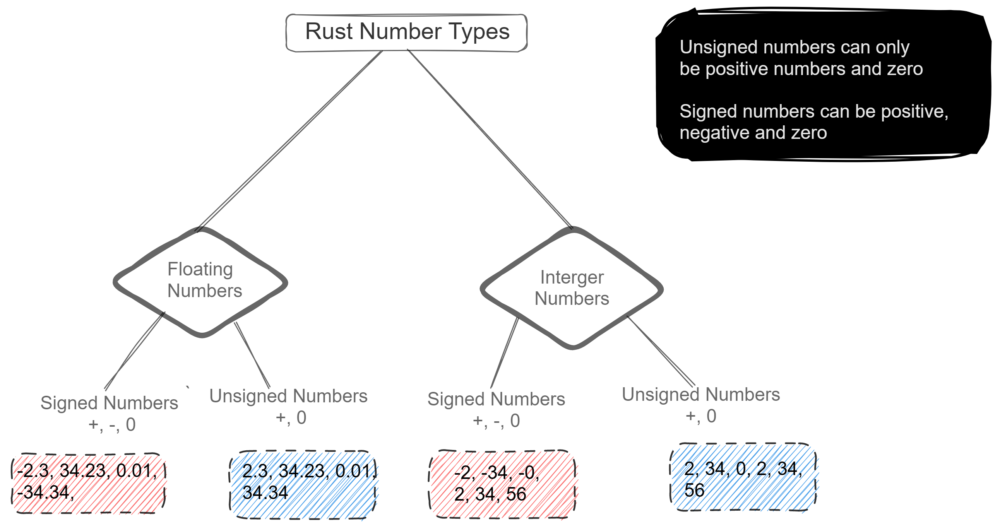

# Everyday Types in Rust: Numbers Edition

Everyday types are a curated list of basic primitive types. They are unavoidable beit as a beginner or veteran with Rust. Example of these types are numbers, strings, array, tuple, and function. In this article, we will limit our discuss to numbers. In subsequent writings, I will discuss on strings, array, tuple etc.

> 
    💀
    This article is targeted at audiences who have had some basic exposure to Rust.
    If this is the first time you are trying Rust out, kindly visit my [article on Hello Rust]()

   


## Number Type
The Number type gives us an hint on what we expect a number variable to be. 

At first, you might think this article is an overkill but it isn't. Numbers in computers are not as easy as human sees them. For one good reason that human thinks in base 10 but computer thinks in base 2 (Ones and Zeros).

While a lot of languages - Javascript for example - abstract how numbers work, Rust embraces it. Rust has a little many subsidiaries for number types. It can be confusing at first time read. However, after this section you would fully have understandd and appreciated numbers and its type in Rust.

**Numbers in Rust** can be divided into two grand-category, Floats and Integers.

### Floating Number Type

[Floating Numbers](https://www.freecodecamp.org/news/floating-point-definition/), also referred as floats, are decimal numbers in short - numbers with a dot in front of them. For example, 4.5, -3.455, 2.0, 3434343434112.445454 are valid Floating numbers while 2, 455, 3434343434112 are not (no decimal in front of them 🤷‍♀️).

Please take note from previous paragraphs, **floating numbers can either be positive or negative**, -3.455, 4.55, 2.0. What matters is that they have decimals ⚡. 

Floating numbers can be further broken down into:
- signed floats
- unsigned floats

From a layman point of view, signed floats are negative floats, and unsigned floats can only be positive floats. A proper definition will be signed integers as a data type are used to represent whole numbers that can be positive, negative, or zero. They are different from unsigned integers, which can only be positive or zero.

Examples of Signed Floats are -2.34, -4.23, 2.3 while Unsigned Floats are the positives 2.34, 4.23, 2.3.



### Integer Number Type
[Integer numbers](https://www.freecodecamp.org/news/integer-definition/), also referred to as integers, are whole numbers including 0. For example 45, 345, 0, -66 are integers, while 45.2, 345.0, 0.454 are not.

Please take note again, **integers can either be positive or negative**, -3, 4, 2 ⚡. This type can be further divided into signed integers and unsigned integers.


## Variations of Number Types
Now that you are familiar with the bigger picture of how numbers are treated in Rust, let's highlight the actual number types.
- Unsigned Integers: 
[u8](https://doc.rust-lang.org/std/primitive.u8.html), 
[u16](https://doc.rust-lang.org/std/primitive.u16.html), 
[u32](https://doc.rust-lang.org/std/primitive.u32.html), 
[u64](https://doc.rust-lang.org/std/primitive.u64.html), 
[u128](https://doc.rust-lang.org/std/primitive.u128.html). Interpreted as unsigned integer of 8 bits, 16 bits and so on.
- Signed Integers: 
[i8](https://doc.rust-lang.org/std/primitive.i8.html), 
[i16](https://doc.rust-lang.org/std/primitive.i16.html), 
[i32](https://doc.rust-lang.org/std/primitive.i32.html), 
[i64](https://doc.rust-lang.org/std/primitive.i64.html), 
[i128](https://doc.rust-lang.org/std/primitive.i128.html). Intepreted as signed integer of 8bits, 16 bits, 32 bits and so on.
- Floating numbers types: 
[f32](https://doc.rust-lang.org/std/primitive.f32.html), and 
[f64](https://doc.rust-lang.org/std/primitive.f64.html). Intepreted as floats of 32 bits etc. It is noteworthy to mention that floats represent both signed and unsigned floats.

The 8, 16, 32 etc behind those letters are to indicate the limit of the number types. For example
- 8 bits represent the number must be between 0 and (2^n-1 - 1 where n = 8) = 127.
    ```rust
        let u_8: u8 = 123;
        let u_8i: u8 = 300; //Panic!! 300 > 127
    ```
    A signed integer of 8 bits, i8 must be in the range of -127 and 127.

    A unsigned integer of 8 bits, u8 must be in the range of 0 and 127.

    No float type of 8 bits but 32 and 65 bits (f32 and f64)

- 16 represent the number must be between 0 and (2^n-1 - 1 where n = 16) = 32,767.
    ```rust
        let u_16: i16 = -12_003;
        let u_16i: i16 = 33_000; //Panic!! 33,000 > 32,767
    ```
    A signed integer of 16 bits, i8 must be in the range of -32767 and 32767.

    A unsigned integer of 16 bits, u8 must be in the range of 0 and 32767.

    No float type of 16 bits.

On a closing note, fill in the appropriate number type in this code below. Check out [the correct answer](https://play.rust-lang.org/?version=stable&mode=debug&edition=2021&gist=1f09d46ad675413cb4f18ed33e9b68ab) after you attempt it.

```rust
fn main (){
     let a: ?? = -2323;
    let b: ?? = 22.3;
    let c: ?? = 323;
    
    println!("{} {} {}", a, b, c);
}
```

A big thank you for reading thus far. I put a lot of intent into this article and I can only hope you did find it useful. Whether you are looking at learning more about Rust, subscribe to my article.

PeaceOut!!!!!!!
***********************************
\#Footer

[extensive explanation of how numbers work in computers -](https://www.practicaldatascience.org/html/ints_and_floats.html#:~:text=Broadly%20speaking%2C%20computers%20have%20two%20ways%20of%20representing,decimal%20points.%20That%20is%20true%20to%20a%20point)
