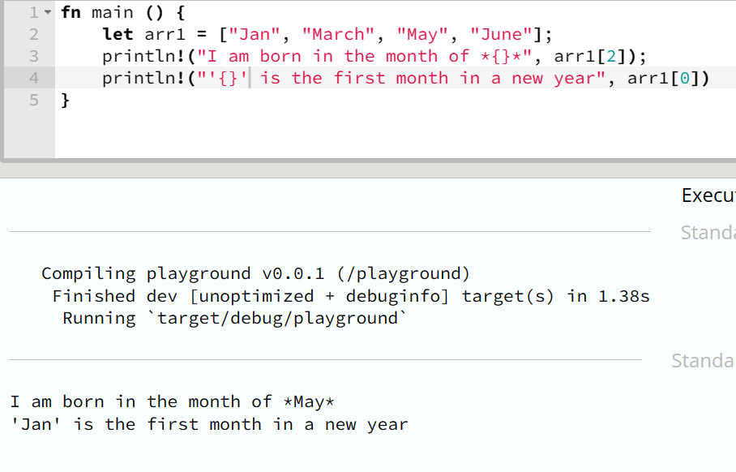

## Array

Historically, the word array means to put in order. Up until now, even in our programming world, not much have changed about this definition. The Array data structure ensures elements entered into it are ordered.

ARRAY is a collection of items of the same type, T, stored in orderly sequence - contiguous - in memory.

The following are the characteristics of array in Rust:

- **Immutability**

  In some languages, items in an array can be deleted or a new item inserted.

  ```js
  let arr = [];
  arr.push("brother");
  arr.push("bernard");
  arr.pop();

  // print arr
  console.log(arr); // ["brother"]
  ```

  In Rust, this manipulation (inserting and deleting) can't be done to an ARRAY. Hence, where it got its first characteristic of _immutability_.

  **Explicit item**

  Array type must be explicitly written. An empty array is useless and unacceptable.

  

## Write your first array

Writing an array takes the following two forms:

- List, _[x, y, z] where x,y,z are same type_ : in this approach, each array item - x, y, z - is listed in the bracket, [], like this

  - `[1, 2, 34]`,
  - `["Jan", "Feb", "March", "April"]`,
  - `[[2, 6], [12, 5], [4, 7], [11, 55]]`.

  

- Repeat expression, _[x; N] where N is a non-negative integer & x is the array item_: This produces an array with `N` copy of `x`. See example below

  - [1; 3],
  - [["Jan", "Dec"]; 12]

  

## Retrieving items in an array

You can retrieve an item with

- An array index, this is the index of an item, `arr[index]`. The index must be a non-negative integer.



- Iterator, .iter(). You can use `for..in` and `.iter()` to retrieve it items.


---

## Tuple

A tuple is a finite ordered list of elements. It is similar to an array with some additional features and limitation alike. Ability to hold multiple types is one of the additional features in a tuple compare to an array - infact the outstanding feature.

One of Tuples limitation is that it is not iterable. Unlike Array that we can use an iterator to access its item, Tuples lack this ability.

> Historically, the word tuple originated from the abstraction of sequence: Single, Couple/Do**uple**, Tr**iple**, Qua**druple**, Quin**tuple** etc.
>
> | Tuple | Length     | Example in Rust                                                |
> | ----- | ---------- | -------------------------------------------------------------- |
> | 0     | emptytuple | ( )                                                            |
> | 1     | monuple    | ( "Kelvinsekx" )                                               |
> | 2     | couple     | ("Kelvinsekx", 25)                                             |
> | 3     | triple     | ("Kelvinsekx", 25, "Ibadan")                                   |
> | 4     | quadruple  | ("Kelvinsekx", 25, "Ibadan", Sex::Male)                        |
> | 5     | emptytuple | ("Kelvinsekx", 25, "Ibadan", Sex::Male, ["Excellent", "Dave"]) |

### Characteristics of Tuples

- Like in arraies, there are no inbuild method of inserting to or deleting an item in a tuple.
- You can not iterate over a tuple using a loop.
- Unlike Array that doesn't support empty array, tuple supports an emplty or null tuple.
- Tuple is written by listing the element in a parenthesis.

### Write your first Tuple

A tuple can be written by listing items in a parenthesis, ( item1, item2...n ). The table above is a perfect example.

### Retrieving items from a Tuple

An item in a tuple can be accessed in two ways

- tuple index, `tuple.INDEX` where INDEX is a non-negative number. For example

  ```rust
  let tt = ("Thanks", "for", "reading");

  tt.0 // "Thanks"
  tt.1 // "for",
  tt.3 // "reading
  ```

- tuple destructuring is a naming pattern of retrieving an item from a tuple. An example is the best way to explain this.
  ```rust
  let (str1, str2, str3) = ("Thanks", "for", "reading");
  str1 // "Thanks",
  str2 // "for",
  str3 // "reading"
  ```
  See a little detailed use on the image


Thank you for reading thus far. If you find this useful, do not hesitate to drop a like. It is one of the painless way to reward my hardwork.
